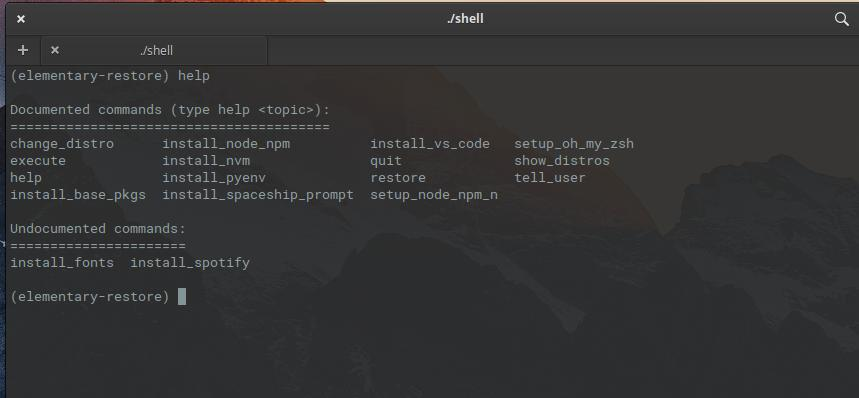

# System Restore

It's a personal and simple (quickly written) script to install
all the usual tools I use on my workstation.

It can be used with the following Gnu/Linux distributions:

- Fedora
- Elementary OS

It gives you a command line tool that lets you execution functions which will install and autoconfigure:

- vscode
- zsh and oh-my-zsh configured for the user that runs the script
- golang (with GOPATH configured for current user)
- pyenv (https://github.com/pyenv/pyenv)
- Fira Code fonts (https://github.com/tonsky/FiraCode/)
- Kitty terminal (https://sw.kovidgoyal.net/kitty/) and autoconfigure it with my prefs
- Kitty themes (https://github.com/dexpota/kitty-themes)
- awesome wm + default config
- flameshot (https://flameshot.js.org/#/) to take screenshots 
- fisavim (http://vim.fisadev.com/)
- node, npm and `n` (node version management, https://github.com/tj/n)
- spaceshipt prompt (https://github.com/denysdovhan/spaceship-prompt)
- NVM node version manager
- Spotify

## How to use it:

Just execute `shell`.

Get a list of supported Gnu/Linux distributions typing the cmd: `show_distros`.

Use `change_distro fedora`  or `change_distro elementary` and then type `help` to get the list of commands.

## It's extensible

Take a look at `dummy.py`. Inside the shell (see above) you can type `change_distro dummy` and all functions
defined in `dummy.py` will be available (check it typing `help` or `?`).  To extend it to Ubuntu, just create
a new file `ubuntu.py` with your functions. Take a look at `fedora.py`, or `elementary.py` to see how it works.

# Power users (?) 

If you like the Awesome WM, you can setup it with my config, here is the result:

## Window manager screenshots (awesome wm) 

# Final note
Maybe this is an overkilling solution (but it works for me). Here is another approach, more simple:

https://github.com/redraw/dotfiles

PR's are welcome!
